# image-shield

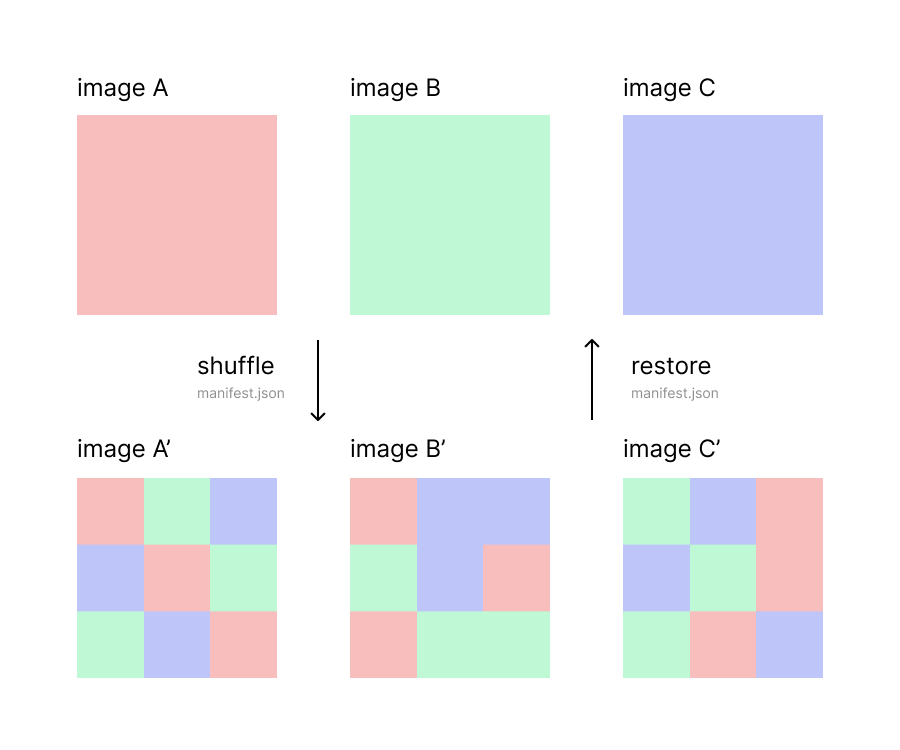

This npm package provides functionality for image fragmentation and restoration.

## Architecture

> [!NOTE]
> Work in progress

This project is a monorepo that contains the following packages:

- **@image-shield/core**: Environment-independent core functionality (types, algorithms, crypto interfaces)
- **@image-shield/node**: Node.js implementation
- **@image-shield/browser**: Browser implementation (coming soon)
- **@image-shield/cli**: CLI implementation

## Features

This package provides image fragmentation functionality:

### 🔀 Shuffle Mode

```
Original Image → Load → Convert to RGBA → Shuffle → Fragmented PNG Output
```

## Installation

```
npm i image-shield
```

## Usage

```
import ImageShield from "image-shield";
```

**Shuffle**

```ts
await ImageShield.shuffle({
  // config: { /** FragmentationConfig */ },
  imagePaths: [
    "./input_1.png",
    "./input_2.png",
    "./input_3.png",
  ],
  outputDir: "./output/fragmented",
});
```

<details>
<summary>Output:</summary>

```
output
└── fragmented
    ├── img_1_fragmented.png
    ├── img_2_fragmented.png
    ├── img_3_fragmented.png
    └── manifest.json
```

| input 1 | input 2 | input 3 |
|:-------:|:---------------:|:---------------:|
|  |  |  |
| 500 x 500px (109KB) | 400 x 600px (4KB) | 600 x 400px (3KB) |

| output 1 | output 2 | output 3 |
|:-------:|:---------------:|:---------------:|
| 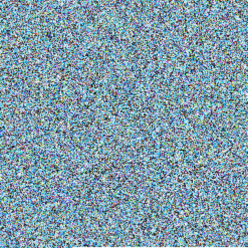 | 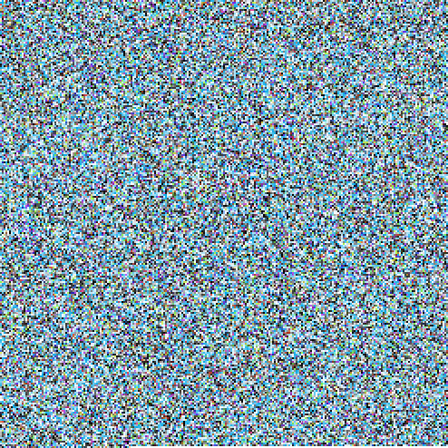 | 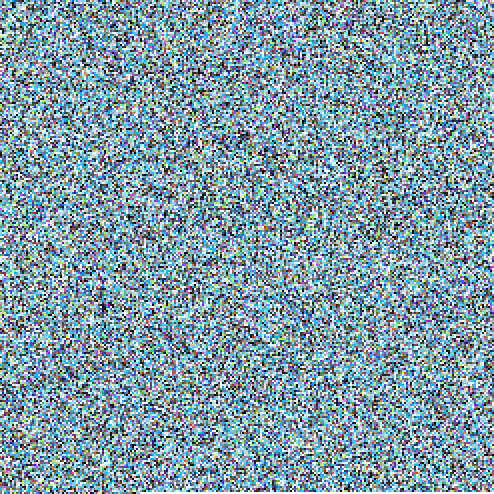 |
| 494 x 494px (334KB) | 494 x 494px (335KB) | 494 x 494px (334KB) |

</details>

**Restore**

```ts
await ImageShield.restore({
  manifestPath: "./output/fragmented/manifest.json",
  imagePaths: [
    "./output/fragmented/img_1_fragmented.png",
    "./output/fragmented/img_2_fragmented.png",
    "./output/fragmented/img_3_fragmented.png",
  ],
  outputDir: "./output/restored",
});
```

<details>
<summary>Output:</summary>

```
output
└── restored
    ├── img_1.png
    ├── img_2.png
    └── img_3.png
```

| input 1 | input 2 | input 3 |
|:-------:|:---------------:|:---------------:|
|  |  |  |
| 494 x 494px (334KB) | 494 x 494px (335KB) | 494 x 494px (334KB) |

| output 1 | output 2 | output 3 |
|:-------:|:---------------:|:---------------:|
| 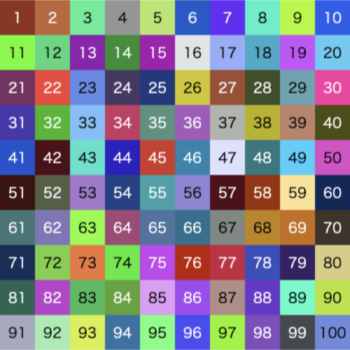 |  |  |
| 500 x 500px (117KB) | 400 x 600px (2KB) | 600 x 400px (2KB) |

</details>

---

## Shuffle Overview

### List by blockSize

| input | blockSize: 1 | blockSize: 2 (default) | blockSize: 3 | blockSize: 4 |
|:-------:|:---------------:|:---------------:|:---------------:|:----------------:|
|  | 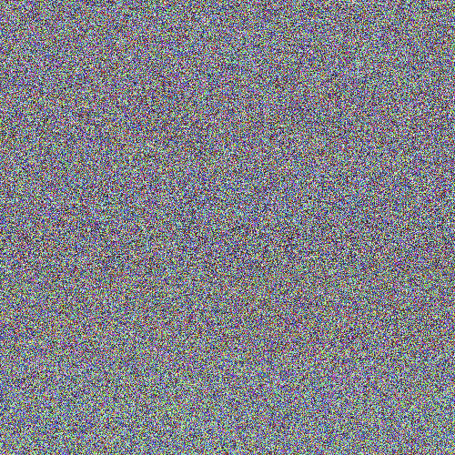 | 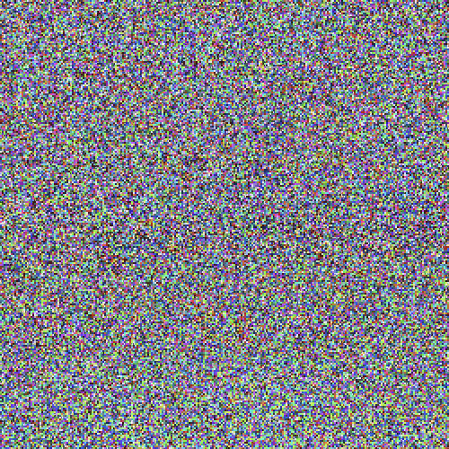 | 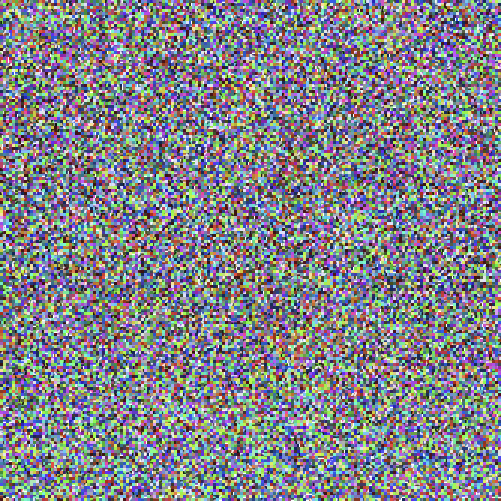 | 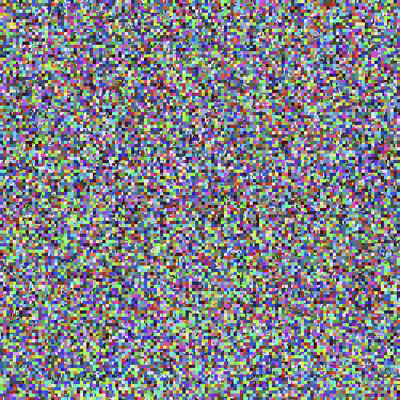 |

| blockSize: 8 | blockSize: 16 | blockSize: 32 | blockSize: 50 | blockSize: 128 |
|:-------:|:---------------:|:---------------:|:---------------:|:----------------:|
| 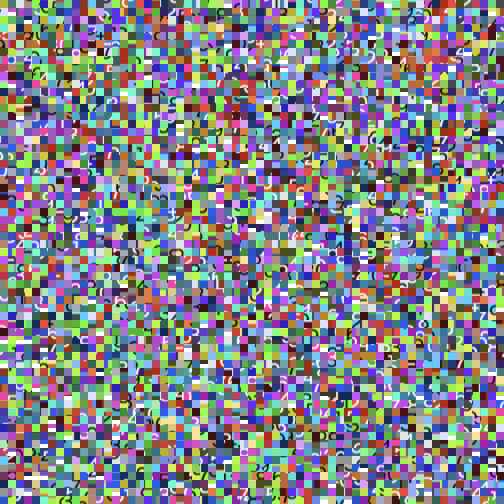 | 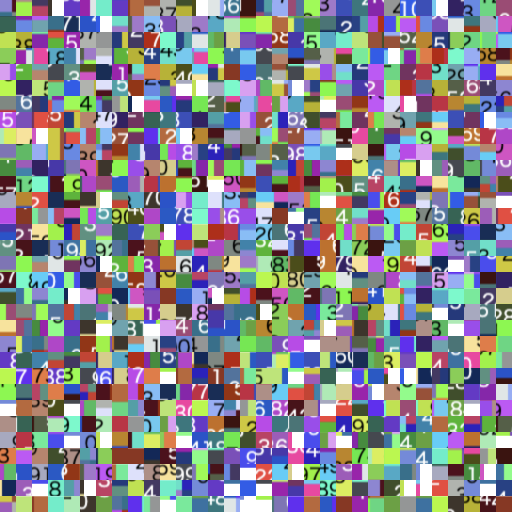 | 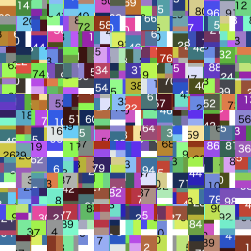 | 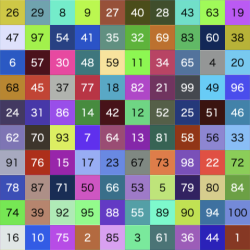 | 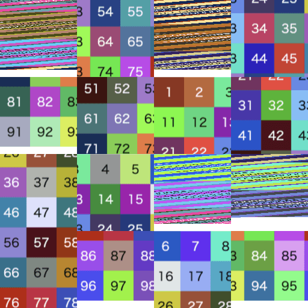 |

### Input multiple images

blockSize: `50` (with `--cross-image-shuffle`)

When processing multiple images with cross-image shuffle enabled, blocks are shuffled across all images.

| input 1 | input 2 | input 3 |
|:-------:|:---------------:|:---------------:|
|  |  |  |

| output 1 | output 2 | output 3 |
|:-------:|:---------------:|:---------------:|
|  | 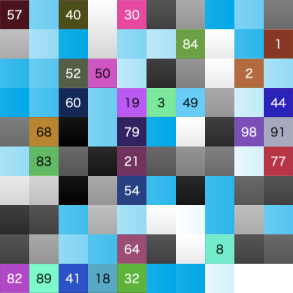 | 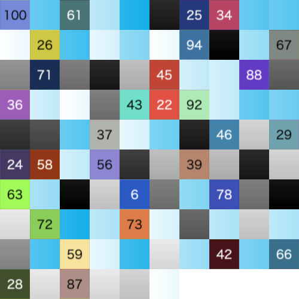 |

> [!WARNING]
> - May cause memory shortage depending on the number of images and block size.

## Manifest Structure

<details>
<summary>manifest.json:</summary>

```json
{
  "id": "fbc13f55-a4a7-4d7d-b9ce-a613d47e4005",
  "version": "0.9.0",
  "timestamp": "2025-11-07T01:37:35.039Z",
  "config": {
    "blockSize": 2,
    "prefix": "img",
    "seed": 72411,
    "preserveName": false,
    "crossImageShuffle": false
  },
  "images": [
    {
      "w": 500,
      "h": 500,
      "c": 4,
      "x": 250,
      "y": 250
    },
    {
      "w": 400,
      "h": 600,
      "c": 4,
      "x": 200,
      "y": 300
    },
    {
      "w": 600,
      "h": 400,
      "c": 4,
      "x": 300,
      "y": 200
    }
  ]
}
```
</details>

---

> [!NOTE]
> - The `manifest.json` file contains the necessary information for restoration.
> - Input images are converted to PNG format.

## Clients

- [Raycast Extension (legacy)](https://github.com/tuki0918/raycast-image-shield)

