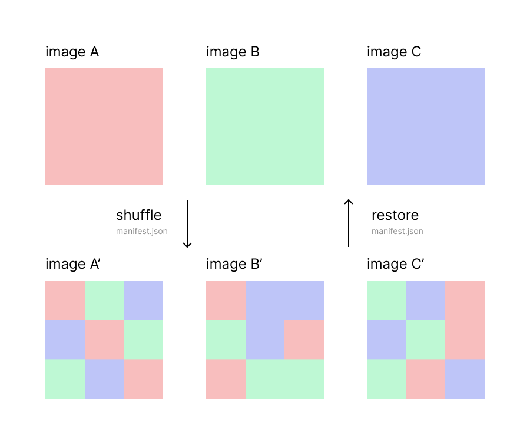
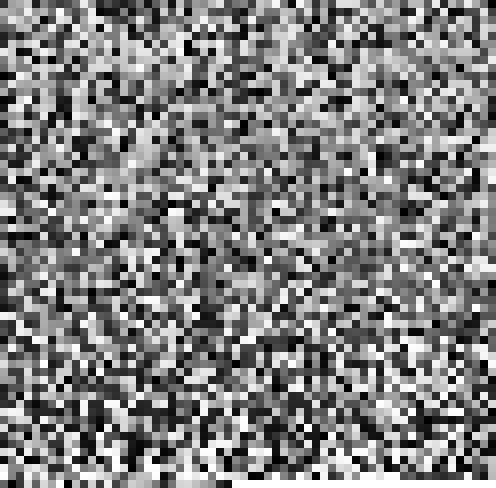
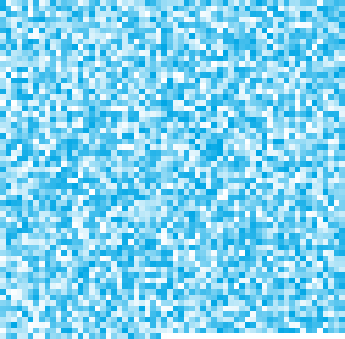
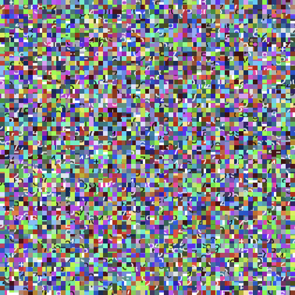
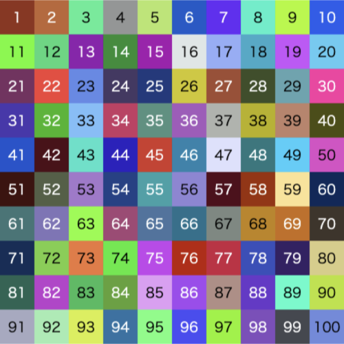
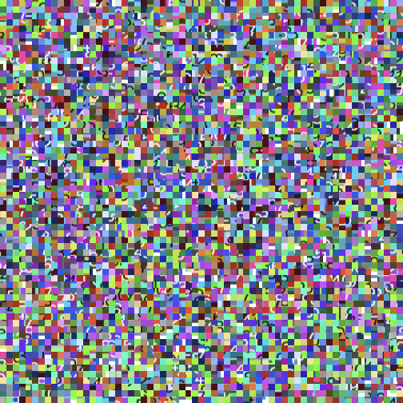
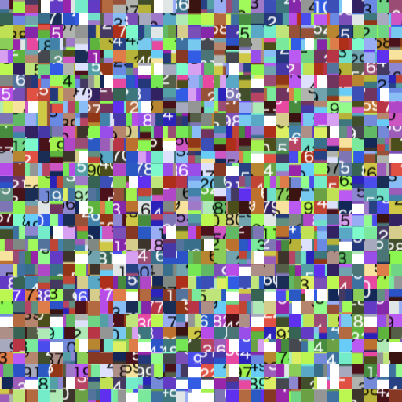
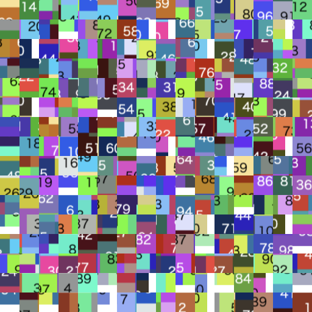
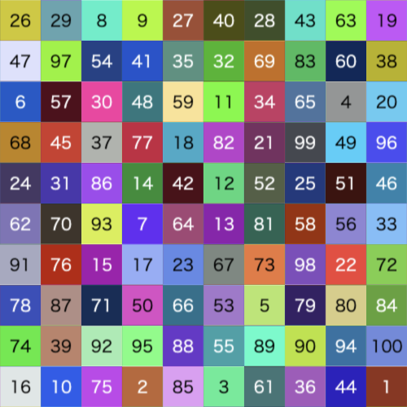
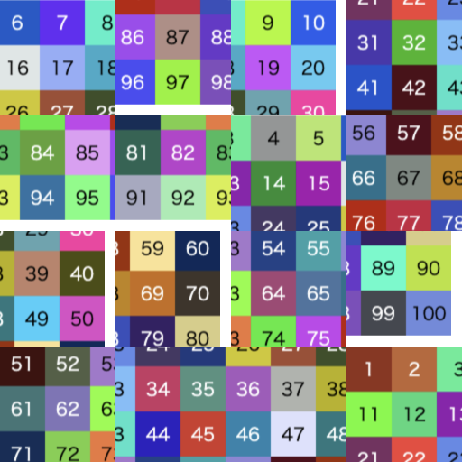

<div align="center">
  
  <h1 align="center">pixzle</h1>
</div>



This npm package provides functionality for image fragmentation and restoration.

Note: This does not guarantee strong security.

## Requirements

- Node >= 20

## Packages

See each package README for usage details.

| Platform | Package | Shuffle | Restore |
|------|-----------|:------:|:------:|
| [CLI](./packages/cli/README.md) | `@pixzle/cli` | ✅ | ✅ |
| [Node.js](./packages/node/README.md) | `@pixzle/node` | ✅ | ✅ |
| [Browser](./packages/browser/README.md) | `@pixzle/browser` | - | ✅ |
| [React](./packages/react/README.md) | `@pixzle/react` | - | ✅ |


## Quick Start (CLI)

You can easily try image fragmentation using the CLI.

```bash
# Install CLI
npm install -g @pixzle/cli

# Shuffle images
pixzle shuffle input.png -o ./output

# Restore images
pixzle restore ./output/*.png -m ./output/manifest.json -o ./restored
```

## Shuffle Overview

### Result Example

| Fragmented | Restored |
|:---:|:---:|
|  |  |
|  |  |
|  |  |

### List by blockSize

You can change the block size with `-b` or `--block-size <number>`.

| input | blockSize: 1 | blockSize: 2 | blockSize: 3 | blockSize: 4 |
|:-------:|:---------------:|:---------------:|:---------------:|:----------------:|
|  |  |  |  |  |

| blockSize: 8 (default) | blockSize: 16 | blockSize: 32 | blockSize: 50 | blockSize: 128 |
|:-------:|:---------------:|:---------------:|:---------------:|:----------------:|
|  |  |  |  |  |

> [!WARNING]
> - May cause memory shortage depending on the value of block size.
